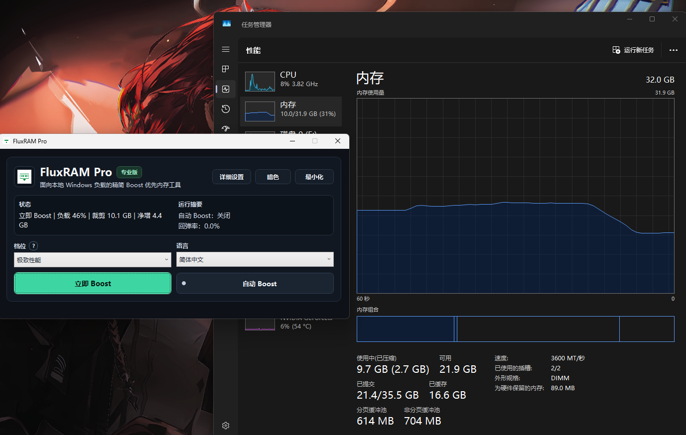
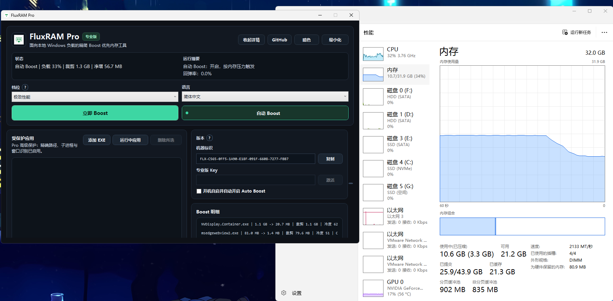

# FluxRAM

English | [简体中文](README.md)

FluxRAM is a local Windows memory Boost tool. It is not designed to aggressively clean memory all the time. Instead, it frees cold background working sets when you ask it to, or when memory pressure rises, while keeping protected apps such as games, creator tools, local AI workloads and streaming software out of the target list.

## Why FluxRAM Exists

Memory prices have made upgrades harder for many budget-conscious users. A lot of 8GB users want to upgrade, but keep putting it off because of the cost, and end up living with a sluggish PC. My own laptop has 12GB, and I have seen browsers crash when memory pressure climbs, so I built FluxRAM for that very practical pain.

FluxRAM does not magically make 8GB behave like 16GB. It does something more realistic: reclaim memory from cold background processes that are sitting on RAM without doing useful work, so the memory you already have lasts a little longer. Real results depend on your workload. In common browser, office, chat and launcher scenarios, you may see anything from a few hundred MB to around 1-2GB reclaimed. Background-heavy systems may see more, and some memory rebound is normal when apps become active again.

I hope FluxRAM can be a simple, convenient Windows tool for people who are not ready to upgrade RAM yet. Because this is an indie project, Pro activation keys are currently issued manually from machine IDs, so please allow a little time after purchase.

## Download

[China mirror (GitCode)](https://gitcode.com/Midas927/FluxRAM/releases) | [GitHub releases](https://github.com/Midas927/FluxRAM/releases/latest)

Recommended package: `FluxRAM-Portable-Windows-x64.zip`. Unzip it and run `FluxRAM.exe`.

FluxRAM and FluxRAM Pro use the same executable. Pro features can only be activated with a key generated for the current machine ID.

`FluxRAM-Lite-Windows-x64.zip` is also available for users who want a smaller download. Lite does not remove features; it only requires `.NET 8 Desktop Runtime` to already be installed. If you are unsure, use the Portable package.

## Demo

These screenshots show FluxRAM running next to Windows Task Manager. Results vary by machine, workload and background process count, so treat them as a real-world interface and effect preview rather than a fixed promise.

  

  

## Core Features

| Feature | FluxRAM | FluxRAM Pro |
| --- | --- | --- |
| Boost Now | Yes | Yes |
| Auto Boost when memory pressure rises | Yes | Yes |
| Daily / Gaming profiles | Yes | Yes |
| Extreme Performance profile | No | Yes |
| Deep Release and background service guidance | No | Yes |
| Tray resident mode and tray Boost | Yes | Yes |
| Add / remove protected apps | Yes | Yes |
| Pick protected apps from running processes | Yes | Yes |
| Process-name protection | Yes | Yes |
| Exact EXE path protection | No | Yes |
| Child-process association protection | No | Yes |
| Window recognition protection | No | Yes |

## FluxRAM

The free edition is meant to feel complete for everyday use:

1. `Boost Now`: run a memory Boost when you need it.
2. `Auto Boost`: trigger automatically when memory pressure becomes high.
3. `Daily` / `Gaming`: conservative profiles for office work, gaming, local AI and creator workloads.
4. Protected app list: add, remove, or pick apps directly from running processes.
5. Tray workflow: minimize to tray and run Boost from the tray menu.
6. Visible metrics: RAM delta, available memory, recent trimmed memory, total trimmed memory, net gain and FluxRAM's own overhead.

## FluxRAM Pro

Pro is for heavier local workloads and more precise protection needs:

1. `Extreme Performance` profile.
2. Deep Release for grouped background processes, idle-state detection and user-confirmed closing.
3. Classification and stop guidance for optional background services.
4. Exact EXE path protection to reduce false matches between processes with the same name.
5. Smart child-process and related-app protection.
6. Permanent activation on the current computer, with no online verification required after activation.

## Pro Activation

FluxRAM Pro can only be activated with a machine-bound key:

1. Open FluxRAM.
2. Copy the machine ID shown in the app.
3. Send the machine ID to sales or support.
4. Enter the Pro Key you receive inside FluxRAM.
5. The key is bound to the current computer. A new computer requires a new key.

Pro Keys are issued officially from the machine ID and are bound to the current computer.

## Purchase

Click `Upgrade Pro` inside the edition help dialog:

- Simplified Chinese opens the in-app Alipay QR and payment steps for RMB 10.
- Other languages open the Whop purchase page for USD $3.

## Local And Safe

1. FluxRAM runs locally and does not rely on cloud telemetry.
2. Boost mainly trims cold background process working sets.
3. Default profiles do not stop system services.
4. Protected apps are excluded from Boost candidates to reduce accidental disruption.

## Documentation

- [Commercial Manual](docs/FluxRAM-Commercial-Manual.en.md)
- [商业说明书](docs/FluxRAM-Commercial-Manual.zh-CN.md)
- [IT Technical Manual](docs/FluxRAM-IT-Technical-Manual.en.md)
- [IT 技术说明书](docs/FluxRAM-IT-Technical-Manual.zh-CN.md)
